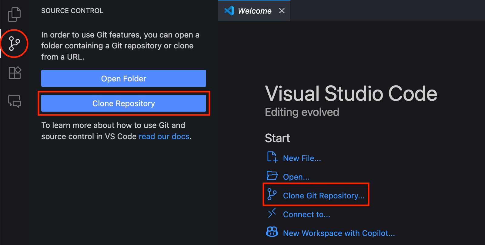
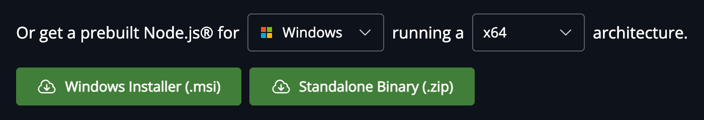
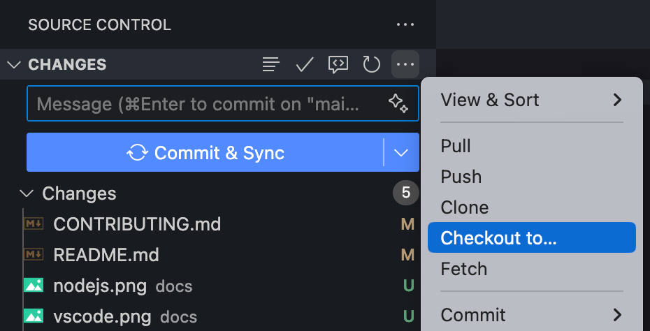
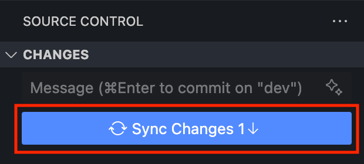

# Contributing to Re: ACCESS

Thank you for your interest in contributing to the project! This document outlines the onboarding procedures, standard formats, pull request guidelines, and other important details to help you get started.

## 🚀 Onboarding Procedures

1. **Get a Local Copy of the Repository**
  Clone the repository to your local machine:
    ```sh
    git clone https://github.com/ACCESS-DLSU/infinity.git
    ```

    Alternatively, using Visual Studio Code, you may select the following option and find the GitHub repository:
    <p align="center">
      
    </p>

2. **Install Dependencies**
  First, download and install [Node.js](https://nodejs.org/en/download) (select the **Installer** option):
    <p align="center">
      
    </p>

    Then, use **npm** to install dependencies:
    ```sh
    npm install
    ```

<!--3. **Set Up Your Environment**
  Copy `.env.example` to `.env` and update any necessary environment variables.-->

4. **Test the Application**
  Start the development server to ensure everything is working correctly:
    ```sh
    npm run dev
    ```
    The website should run in your browser at `http://localhost:3000`.

## 🌿 Branching and Pushing Guidelines

- **Push to the `dev` Branch**: All contributions should be pushed to the `dev` branch:
  ```sh
  git checkout dev
  ```
  Or in VS Code:
  <p align="center">
    
  </p>
- **No Direct Pushes to `main`**: The `main` branch is protected. All changes must go through pull requests targeting `dev`.
- **Sync Regularly**: Pull the latest changes from `dev` before starting new work:
  ```sh
  git checkout dev
  git pull origin dev
  ```
- **Feature Branches (Optional)**: For larger features or fixes, you may create a feature branch off `dev` (e.g., `feature/your-feature-name`) and push your work there before merging into `dev`.

## 📋 Standard Formats

- **Code Style**: Follow the existing code style. Use Prettier and ESLint for formatting and linting.
- **Commits**: Use [Conventional Commits](https://www.conventionalcommits.org/en/v1.0.0/):
  - `feat: add new feature`
  - `fix: fix a bug`
  - `docs: update documentation`
  - `refactor: code refactoring`
  - `test: add or update tests`
  - `chore: maintenance tasks`
- **File Naming**: Use `camelCase` for files and folders, except React components which use `PascalCase`.
- **Component Structure**: Place components in the `src/` directory, using one file per component when possible.

## 🔄 Pull Request Guidelines

1. **Sync with Upstream**
  Before opening a PR, ensure your branch is up to date with `main`:
    ```sh
    git fetch origin
    git rebase origin/main
    ```
    Or in VS Code:
    <p align="center">
      
    </p>
2. **Test Your Changes**
  Run all tests and ensure the app builds and runs locally.
3. **Describe Your PR**
  Provide a clear description of your changes and reference any related issues.
4. **Small, Focused PRs**
  Submit small, focused pull requests for easier review.
5. **Review Process**
  At least one approval is required before merging.
  Address all review comments and suggestions.

## ℹ️ Other Important Details

- **Issue Reporting**: Use the issue tracker to report bugs or request features. Provide as much detail as possible.
- **Code of Conduct**: Be respectful and inclusive. See `CODE_OF_CONDUCT.md` for details.
- **Contact**: For questions, open an issue or contact the maintainers.

## 🙏 Appreciation

We appreciate your contributions and commitment to improving this project! As a private repository, your trusted collaboration, feedback, and ideas are especially valued. Together, we can build something great for our team and community. Thank you for being an essential part of this effort!