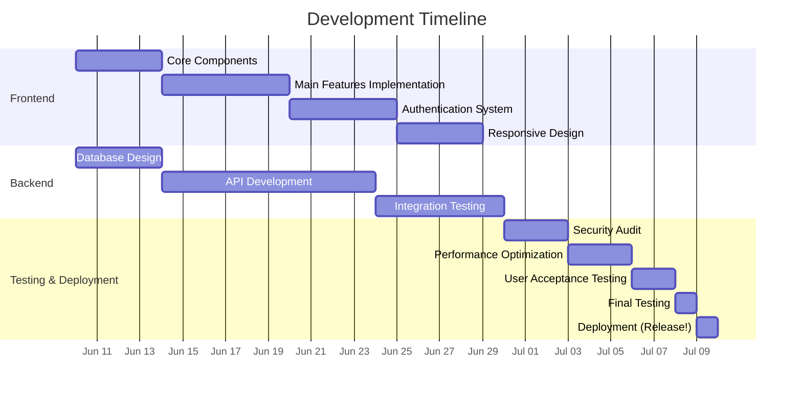

<h1 align="center">ACCESS Project Infinity</h1>

## 📅 Release Date

The first version of the website is scheduled for release on **July 9, 2025 (Wednesday)**.

## 🤝 Contributing

We welcome contributions! Please feel free to:
1. Check the [Issues](https://github.com/ACCESS-DLSU/infinity/issues) tab
2. Suggest new features
3. Report bugs
4. Submit pull requests

See **[CONTRIBUTING.md](CONTRIBUTING.md)** for guidelines.

## 📊 Project Timeline

## 🛠️ Tech Stack

### Frontend
| Technology | Description |
|------------|-------------|
| [Solid.js](https://www.solidjs.com/) | Declarative, efficient, and flexible JavaScript library for building user interfaces |
| [Vite](https://vitejs.dev/) | Next Generation Frontend Tooling |
| [solid-start](https://start.solidjs.com/) | SPA-like routing with no page reloads |
| [Tailwind CSS](https://tailwindcss.com/) | Utility-first CSS framework for rapid UI development |
| [shadcn-solid](https://shadcn-solid.vercel.app/) | Re-usable components built with Radix UI and Tailwind CSS |

### Backend
| Technology | Description |
|------------|-------------|
| SQL Database | For structured data storage |
| CDN | For image/media storage |
| Authentication | Hybrid approach (Traditional login + DLSU Gmail) |
| [Firebase](https://firebase.google.com/) | Google account authentication and backend services |

### Hosting
| Technology | Description |
|------------|-------------|
| [Cloudflare Pages](https://pages.cloudflare.com/) | Free tier with private repo support, fast builds, and DDoS protection |

### Development
| Technology | Description |
|------------|-------------|
| [Vitest](https://vitest.dev/) | Vite-native testing framework |
| [TypeScript](https://www.typescriptlang.org/) | For type safety and better developer experience |
| [ESLint](https://eslint.org/) | Code linting |
| [Prettier](https://prettier.io/) | Code formatting |

## 📜 Code of Conduct

Please review our [Code of Conduct](CODE_OF_CONDUCT.md) to foster a welcoming and respectful community.

## 📝 License

This project is licensed under the terms of the [AGPL-3.0 License](LICENSE).
